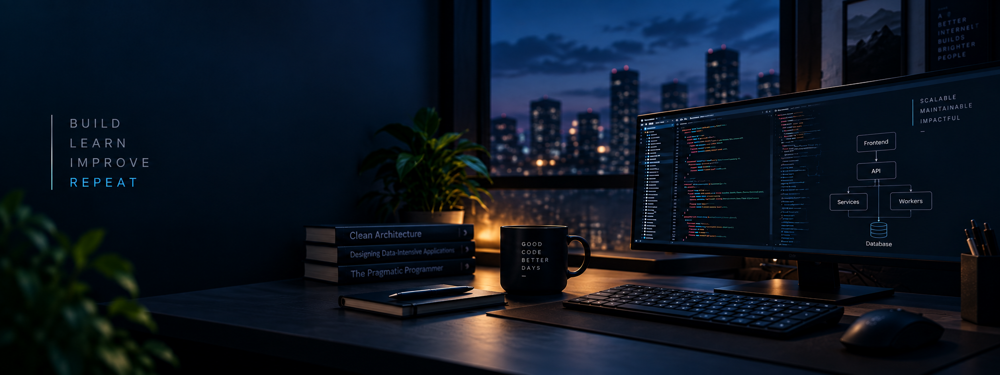

# Hello There! 👋

I am **LucasNBS**.

I am a Full Stack Developer focused on building maintainable web applications with **Next.js**, **React.js** **TypeScript**, **Django**, **Django REST Framework** and **Python**.

I have experience working on production systems used by thousands of users, contributing to front-end and back-end development, API integrations, refactoring, performance improvements, accessibility, testing and system maintenance.

Currently studying Systems Analysis and Development at IFRN and deepening my knowledge in system design and software architecture.

## Tech Stack

**Front-end:** Next.js, React.js, TypeScript, JavaScript, HTML, CSS  
**Back-end:** Django, Django REST Framework, Python, REST APIs, PostgreSQL  
**Tools:** Docker, Git, GitHub Actions, CI/CD, NGINX  
**Practices:** Testing, refactoring, accessibility, SEO, performance and componentization

## Contact

LinkedIn: [linkedin.com/in/lucasnbs](https://www.linkedin.com/in/lucasnbs/)  
Email: lucasnbs.dev@gmail.com
